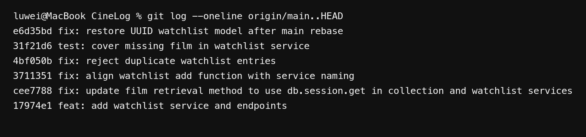

# PR Response Doc — CineLog Watchlist Feature

## AI Usage

I used Codex to find watchlist call sites, compare the service patterns, and check commit messages. I wrote both design positions first, then used its counterarguments to add the privacy opt-out issue and the newest-first precedent.

## Comment 1 — Rename

**What I did:** Renamed `save_to_watchlist()` to `add_to_watchlist()` in `services/watchlist_service.py` and updated the import and only call site in `routes/watchlist/watchlist.py`. I searched both names across the repository to confirm that no old reference remained.

**How I verified:** Ran `pytest tests/ -v` on the remote test environment; all 4 existing tests passed.

## Comment 2 — Deduplication

**What I did:** Followed the collection service pattern by checking for an existing `(user_id, film_id)` entry before insertion. A duplicate now raises `AlreadyInWatchlistError`, and the route returns HTTP 409 instead of creating another row.

**How I verified:** Compared the check with `add_to_collection()` and ran the full test suite remotely; all 4 existing tests passed.

## Comment 3 — Missing Test

**What I did:** Added `tests/test_watchlist.py` with the same isolated app, user fixture, fake film ID, and `pytest.raises(FilmNotFoundError)` structure used by `test_add_to_collection_nonexistent_film_raises()`.

**How I verified:** `pytest tests/test_watchlist.py -v` passed 1 test, and `pytest tests/ -v` passed all 5 tests remotely.

## Comment 4 — Default Visibility

**My position:** Keep `public=True` as the current default.

**Reasoning:** This choice assumes CineLog presents watchlists as community profile data, not that every list in a community app should automatically be public. Under that product intent, a visible watchlist supports discovery and lets other users see what someone plans to watch without an extra setup step.

**Tradeoff acknowledged:** A watchlist can reveal interests that a user expected to keep private, and the current POST route gives the user no creation-time opt-out. The product should state the default clearly and add an explicit visibility control before treating this as a permanent policy; a privacy-first version of CineLog should instead default to private.

## Comment 5 — Sort Order

**My position:** Keep alphabetical order as the default.

**Reasoning:** My product hypothesis is that a watchlist is often revisited to find a remembered title. With no search or sort parameter, a stable alphabetical order remains predictable as the list grows and makes older saved films easier to locate.

**Engagement with reviewer's point:** Newest-first would show recent additions and match `get_collection()`. I kept alphabetical because a watchlist is mainly used to find saved titles, but this is still a product assumption rather than proven user behavior.

## Comment 6 — Rebase

**What conflicted:** `git rebase origin/main` completed without text conflict markers, but it exposed a semantic conflict in `models.py`: the UUID refactor on `main` removed `WatchlistEntry`, while the rebased watchlist service still imported it. The watchlist service and route also retained integer-ID documentation.

**How I resolved it:** Restored `WatchlistEntry` on top of the refactored models with a UUID `film_id` foreign key and a `Film` relationship, preserving both the UUID migration and watchlist retrieval. I also updated the service and route documentation to require a film UUID.

**How I verified no conflict remains:** `git ls-files -u` returned nothing, searches found no conflict markers or old integer-ID references, and all 5 remote tests passed. I also confirmed the 409, 404, and alphabetical GET cases.

## Commit History

## PR Description

### What This Feature Does

The watchlist API lets a user save a film for later and retrieve saved films in alphabetical order. It rejects nonexistent films and duplicate watchlist entries with explicit errors.

### Design Decisions

- Watchlist entries remain public by default because CineLog currently emphasizes community discovery; the privacy tradeoff is documented above.
- The default response remains alphabetical because stable title lookup is more useful for a growing list than recency alone.

### Manual Test

1. Start CineLog with one user and two films in the database, then record their UUIDs.
2. Add the alphabetically later film first, then the earlier film, using `POST /watchlist/<user_id>/add` with JSON `{"film_id": "<film_uuid>"}`; confirm HTTP 201 for both.
3. Repeat either add request and confirm HTTP 409.
4. Send the add request with a nonexistent film UUID and confirm HTTP 404.
5. Send `GET /watchlist/<user_id>` and confirm both films are returned in alphabetical order.
